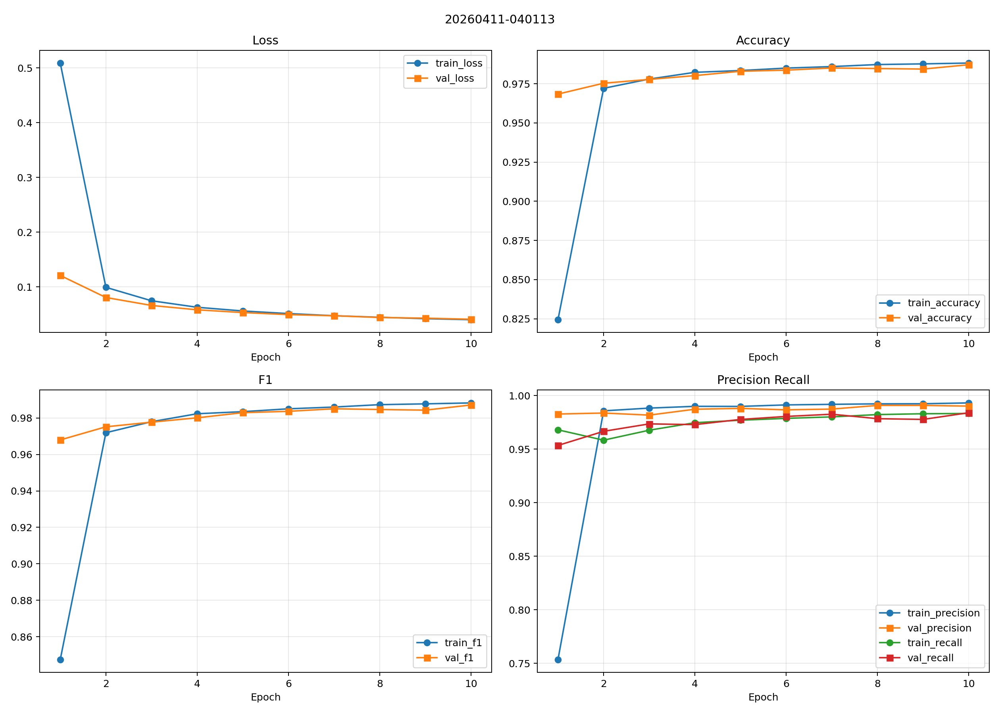
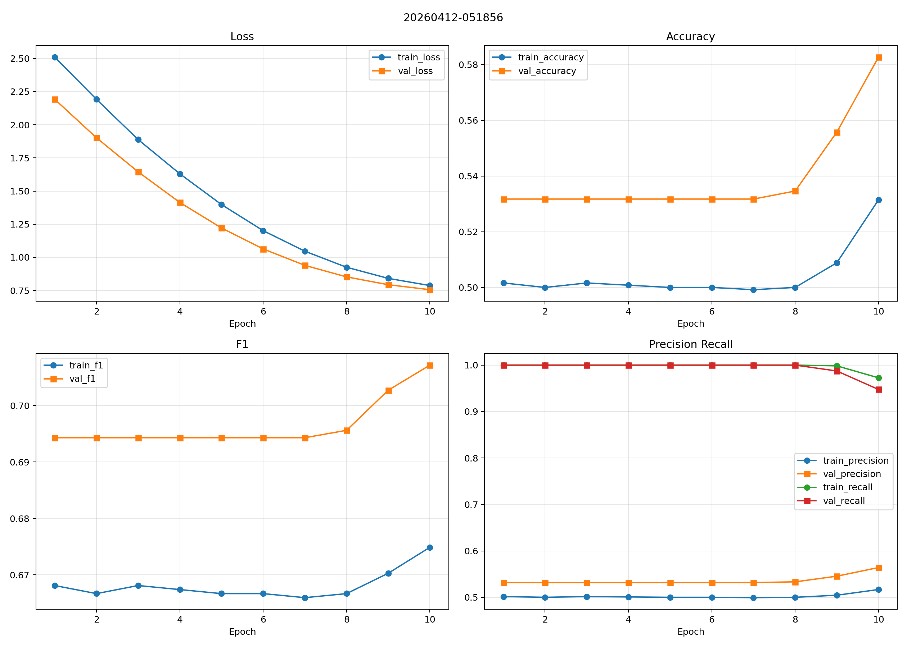
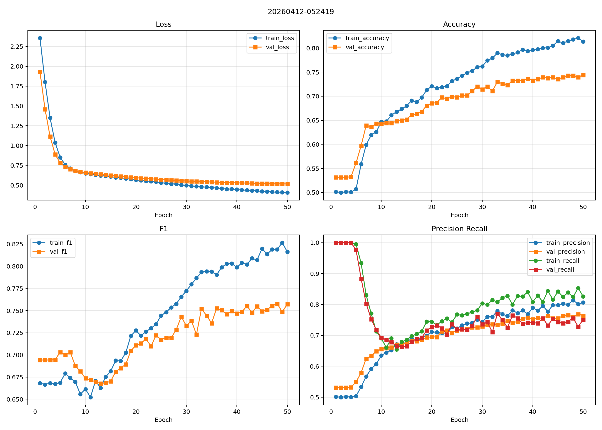
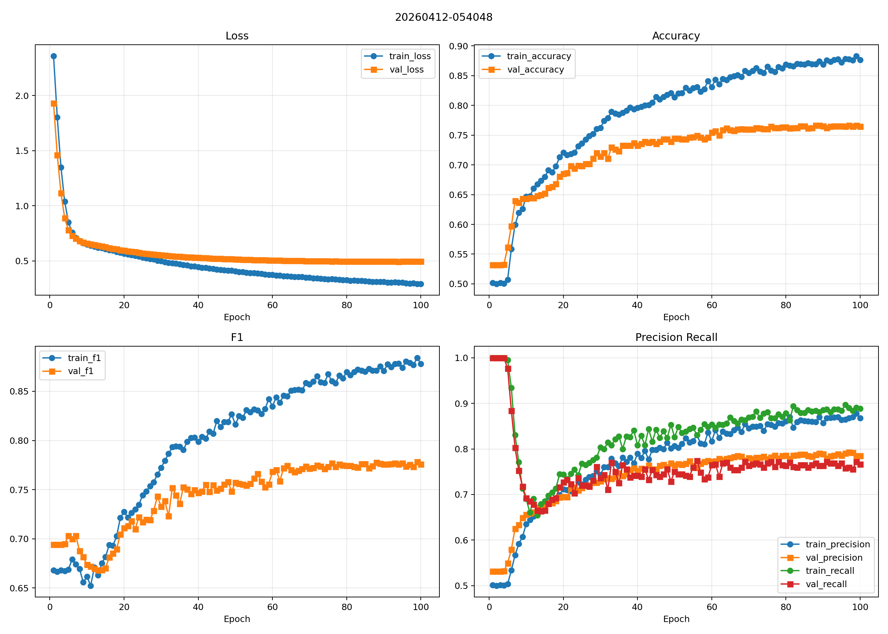

# AV-HuBERT Baseline 实验报告

## 目录

- [摘要](#abstract)
- [一、任务与实验设计](#task-design)
- [二、实验配置](#config)
- [三、实验结果](#results)
- [四、结果分析](#analysis)
- [五、结论](#conclusion)

## 摘要

本文根据 [[Initial Plan]]，围绕 <strong>SSR-DFD 风格的 frozen AV-HuBERT linear probe baseline</strong>，完成了两组 pilot 实验：  
第一组是在 <strong>AV-Deepfake1M (AV1M)</strong> 上做 in-domain baseline；第二组是在 <strong>MAVOS-DD English small</strong> 上做 `open_set_model` 条件下的 unseen-generator pilot。当前结果表明，<strong>冻结 AV-HuBERT + 单层线性头</strong> 在 AV1M 上已经可以取得非常强的效果，`test_f1` 达到 <strong>0.9895</strong>；而在更难的 MAVOS-DD 英语开放集小样本上，最好验证表现达到 <strong>val_f1=0.7785</strong>，说明这一 baseline 仍然有效，但 open-set 条件明显更难。进一步比较 `10 / 50 / 100 epoch` 的结果可以看到，<strong>增加训练轮数在 10 到 50 epoch 区间收益明显，但 50 到 100 epoch 已经进入边际收益递减区</strong>，因此后续重点不应再只是继续增大 epoch，而应转向更完整的数据协议、阈值校准和更严格的泛化评估。

## 一、任务与实验设计

### 1. Baseline 思路

本文使用的检测框架与 [[Initial Plan]] 中的第一阶段设计一致，核心是验证：

- 预训练 `AV-HuBERT (audio-visual)` 表征是否已经足够强
- 在 backbone 全冻结时，仅训练轻量分类头，是否仍能在 deepfake detection 上取得有效结果

整体结构保持为：

| 模块 | 当前实现 |
| --- | --- |
| Backbone | 预训练 `AV-HuBERT (audio-visual)` |
| 参数策略 | 冻结 backbone，仅训练线性分类头 |
| 分类头 | `Linear(1024, 1)` |
| 聚合 | `log-sum-exp pooling` |
| 输入 | `mouth ROI video + cached audio features` |
| 损失 | `BCEWithLogitsLoss` |

### 2. 当前实际使用的数据切片

当前并未直接覆盖 [[Initial Plan]] 中提到的全部数据集，而是先完成两个 pilot：

| 数据集 | 当前使用的数据切片 | 作用 |
| --- | --- | --- |
| AV1M | `AV-Deepfake1M/val` 中的 `real.mp4` 与 `fake_video_fake_audio.mp4` | 建立 in-domain 强 baseline |
| MAVOS-DD | `English small`，其中 `train` 按 `1/5` 抽样，`val` 全量，`test` 为 `open_set_model=true` 的 `1/5` 抽样 | 观察 unseen-generator 条件下的初步泛化能力 |

当前 MAVOS-DD 英语小样本的有效样本规模为：

| Split | 原始 split 数量 | 预处理后可用样本数 |
| --- | ---: | ---: |
| Train | `1277` | `1237` |
| Val | `1079` | `1036` |
| Test | `1590` | `1477` |

> 这里的 MAVOS-DD 实验是 <strong>English-only + open_set_model pilot</strong>，不是完整的 MAVOS-DD 全量 benchmark。

## 二、实验配置

三个数据集实验共享的核心训练参数如下：

| 参数 | 数值 |
| --- | --- |
| `max_frames` | `300` |
| `image_crop_size` | `88` |
| `learning_rate` | `1e-3` |
| `weight_decay` | `1e-4` |
| `grad_clip_norm` | `5.0` |
| `amp` | `false` |
| 训练方式 | 8 卡 DDP |

本次实际对比的 run 配置如下：

| 实验 | 输出目录 | Epoch | Batch Size | Devices |
| --- | --- | ---: | ---: | --- |
| AV1M baseline | [20260411-040113](/root/shared-nvme/Audio_Vedio_Detection/outputs/avhubert/av1m_val_real_fullfake/20260411-040113) | `10` | `4` | `8 GPUs` |
| MAVOS Run A | [20260412-051856](/root/shared-nvme/Audio_Vedio_Detection/outputs/avhubert/mavos_dd_english_small/20260412-051856) | `10` | `8` | `8 GPUs` |
| MAVOS Run B | [20260412-052419](/root/shared-nvme/Audio_Vedio_Detection/outputs/avhubert/mavos_dd_english_small/20260412-052419) | `50` | `4` | `8 GPUs` |
| MAVOS Run C | [20260412-054048](/root/shared-nvme/Audio_Vedio_Detection/outputs/avhubert/mavos_dd_english_small/20260412-054048) | `100` | `4` | `8 GPUs` |

## 三、实验结果

### 1. AV1M baseline 结果

来源：
- [summary.json](/root/shared-nvme/Audio_Vedio_Detection/outputs/avhubert/av1m_val_real_fullfake/20260411-040113/summary.json)

| 指标 | 数值 |
| --- | ---: |
| `best_epoch` | `10` |
| `best_val_f1` | `0.9871` |
| `test_accuracy` | `0.9892` |
| `test_precision` | `0.9966` |
| `test_recall` | `0.9825` |
| `test_f1` | `0.9895` |
| `test_loss` | `0.0395` |

图 1：AV1M in-domain baseline 训练曲线，配置为 `epochs=10`、`batch_size=4`、`8 GPUs`。该图对应 [20260411-040113](/root/shared-nvme/Audio_Vedio_Detection/outputs/avhubert/av1m_val_real_fullfake/20260411-040113)，可见在当前 AV1M 切片上模型很快收敛，`10 epoch` 已足够达到稳定高性能。

### 2. MAVOS-DD English small 结果对比

来源：
- [20260412-051856/summary.json](/root/shared-nvme/Audio_Vedio_Detection/outputs/avhubert/mavos_dd_english_small/20260412-051856/summary.json)
- [20260412-052419/summary.json](/root/shared-nvme/Audio_Vedio_Detection/outputs/avhubert/mavos_dd_english_small/20260412-052419/summary.json)
- [20260412-054048/summary.json](/root/shared-nvme/Audio_Vedio_Detection/outputs/avhubert/mavos_dd_english_small/20260412-054048/summary.json)

| Run | Epoch | Batch | Best Epoch | Best Val F1 | Test Acc | Test Precision | Test Recall | Test F1 | Test Loss |
| --- | ---: | ---: | ---: | ---: | ---: | ---: | ---: | ---: | ---: |
| `20260412-051856` | `10` | `8` | `10` | `0.7072` | `0.6405` | `0.6568` | `0.9529` | `0.7776` | `0.8898` |
| `20260412-052419` | `50` | `4` | `48` | `0.7579` | `0.6655` | `0.7503` | `0.7387` | `0.7445` | `0.6484` |
| `20260412-054048` | `100` | `4` | `99` | `0.7785` | `0.6689` | `0.7780` | `0.6967` | `0.7351` | `0.6812` |

图 2：MAVOS-DD English small，Run A 的训练曲线，配置为 `epochs=10`、`batch_size=8`、`8 GPUs`。该图对应 [20260412-051856](/root/shared-nvme/Audio_Vedio_Detection/outputs/avhubert/mavos_dd_english_small/20260412-051856)，主要用于观察短训练轮数下的快速 baseline 表现。

图 3：MAVOS-DD English small，Run B 的训练曲线，配置为 `epochs=50`、`batch_size=4`、`8 GPUs`。该图对应 [20260412-052419](/root/shared-nvme/Audio_Vedio_Detection/outputs/avhubert/mavos_dd_english_small/20260412-052419)，可以看到相比 10 epoch，验证集指标有明显提升。

图 4：MAVOS-DD English small，Run C 的训练曲线，配置为 `epochs=100`、`batch_size=4`、`8 GPUs`。该图对应 [20260412-054048](/root/shared-nvme/Audio_Vedio_Detection/outputs/avhubert/mavos_dd_english_small/20260412-054048)，显示模型在更长训练下继续收敛，但后期收益已明显趋缓。

## 四、结果分析

### 1. Frozen AV-HuBERT baseline 是否成立

结论是 <strong>成立</strong>。

证据很直接：
- 在 AV1M in-domain pilot 上，`test_f1 = 0.9895`
- 在 MAVOS-DD English small open-set pilot 上，最好验证表现达到 `0.7785`

这说明冻结的自监督 `AV-HuBERT` 表征本身已经携带了足够强的判别信息，单层线性头就可以构成一个有解释力的 baseline。

### 2. Open-set model 是否明显更难

结论是 <strong>明显更难</strong>。

从结果对比可以看到：
- AV1M pilot：`test_f1 = 0.9895`
- MAVOS-DD English small：最好 `test_f1` 约在 `0.735 ~ 0.745`

这说明当分布从“较接近同分布的 AV1M pilot”迁移到“英语 unseen-generator pilot”后，性能出现了显著下降。这个现象和 [[Initial Plan]] 中“第二阶段更强调泛化压力”的判断一致。

### 3. Epoch 增大是否还值得继续

结论是 <strong>10 到 50 epoch 很值得，50 到 100 epoch 收益已经明显变小</strong>。

具体表现：
- `10 -> 50 epoch`
  - `best_val_f1: 0.7072 -> 0.7579`
  - 收益明显
- `50 -> 100 epoch`
  - `best_val_f1: 0.7579 -> 0.7785`
  - 有收益，但已经接近平台区

同时，`100 epoch` 虽然取得了最高的 `best_val_f1`，但 test `F1` 没有继续提升，反而表现出更保守的预测风格：
- `precision` 上升
- `recall` 下降

因此当前更合理的判断是：
- 单纯继续无上限增大 epoch 的价值已经不大
- 后续更值得尝试的是：
  - 阈值校准
  - 更完整的 MAVOS-DD 测试协议
  - 更大范围的数据切片

## 五、结论

结合 [[Initial Plan]]，当前实验可以给出一个阶段性结论：

1. <strong>已验证</strong>：  
   frozen `AV-HuBERT + linear probe` 是一个成立且足够强的 baseline。

2. <strong>已验证</strong>：  
   同一套框架可以从 AV1M 平滑迁移到 MAVOS-DD English small，并在 unseen-generator 条件下保持可用表现。

3. <strong>已验证</strong>：  
   open-set / unseen model 条件明显比 AV1M 当前 in-domain pilot 更难。

4. <strong>部分验证</strong>：  
   增大训练轮数确实有帮助，但收益主要集中在 `10 -> 50 epoch`，到 `100 epoch` 已经进入边际收益递减区。

5. <strong>尚未完成</strong>：  
   当前还没有完成：
   - FAVC / AV1M 的严格 cross-dataset 对齐
   - MAVOS-DD 全量 out-of-model benchmark
   - MVAD 扩展实验

因此，当前最准确的总结是：

> <strong>我们已经完成了一个可信的 AV-HuBERT baseline pilot：它在 AV1M 上非常强，在 MAVOS-DD English small 的 open-set model 条件下也具备可用的泛化能力；但开放集场景显著更难，后续工作的重点不应只是继续增加 epoch，而应转向更完整的评估协议和更复杂分布上的验证。</strong>
